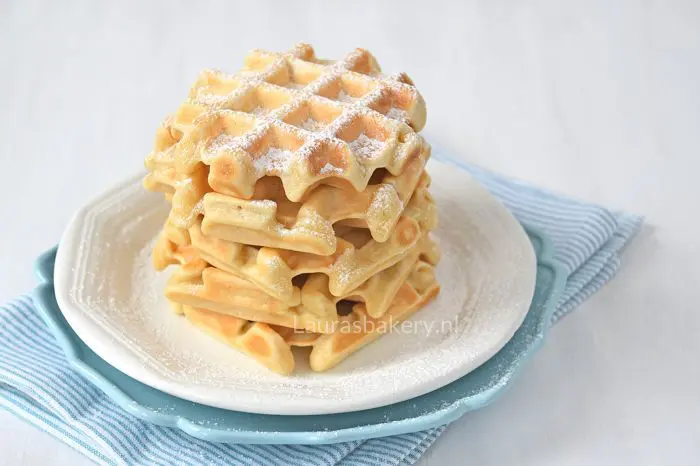

# WAFELS

## BENODIGHEDEN

INGREDIËNTEN
* 380 gram bloem
* 1 el bakpoeder
* snuf zout
* 2 el fijne kristalsuiker
* 2 eieren (M)
* 380 ml melk
* 6 el olie
* 1 tl vanille extract

### BEREIDING

1. Doe de droge ingrediënten -bloem, bakpoeder, zout en suiker- in een kom en roer met een garde door elkaar.
2. Voeg dan de eieren, melk, olie en vanille extract toe. Klop met de garde tot een egaal beslag.
3. Verhit je wafelijzer en vet deze in. Ik gebruik hiervoor een bakspray.
4. Afhankelijk van de grootte van je ijzer, vul je de platen met 1,5-2 ijslepels beslag. Sluit het wafelijzer en bak tot ze goudbruin beginnen te kleuren. Hoe lang dat duurt verschilt per ijzer. Bij mij hadden ze ongeveer 5-7 minuten nodig.
5. Eenmaal uit het ijzer leg je ze op een rooster om af te koelen. Of je eet ze gelijk warm op ?

https://www.laurasbakery.nl/zelf-wafels-maken/ 